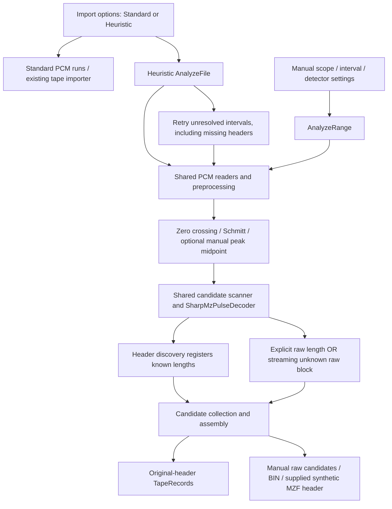

# Headerless payload recovery and heuristic parity — 2026-10-10

## Baseline commit

HEAD: `0ef87e798139c8a7dcc09cbca4bd0ad46ff2c65b`. The baseline includes the existing uncommitted visual/manual audio implementation and the already-approved header-validation correction. The working tree was preserved, without pulling over local changes or committing recordings. Before this change, 119 recovery/heuristic/shared-decoder tests passed with the original real capture configured.

## Test input identities (hashes)

| Input | PCM | Frames / duration | SHA-256 |
|---|---|---|---|
| `C:\333\AudioStarB03A_selection.wav` | 44100 Hz, mono, 24 bit | 31337158 / 710.593152 s | `B051AB477A227385B76BE223C96A3A35A66E3DBADE139BA0479B22B8265DCFEC` |
| `C:\333\explo_payload.wav` | 44100 Hz, stereo, 16 bit | 12096716 / 274.301950 s | `68B2AFF62A90A85DF7336CF4C2D0EA763804AC018CD542D1D9385C8E5C52C362` |

`recovered_1_Exploding_Fist.mzf` was not available. Payloads were compared byte-for-byte against the independently decoded original capture in this environment; equivalence to the absent external reference is not claimed. Both WAV hashes remain unchanged.

## Manual vs Heuristic flow comparison



The UI checkbox **Use heuristic analysis / recovery** still defaults to false. Standard invokes `SharpTapeImporter.ReadFile`; Heuristic opens `WavAnalysisProgressWindow` and calls `AnalyzeFile`. Standard fallback is considered by the existing `AudioImportPolicy` after heuristic analysis, and is not the manual decoder. Batch audio imports likewise select their backend from `UseHeuristicAnalysis`.

Manual Auto explicitly selects Zero crossing and Schmitt, both polarities and chosen channels, with the entered gating scales. Manual classification/reference/half-sample/transform settings remain explicit; automatic import does not silently apply every experimental manual option.

## Observed failing stage

The claimed current Exploding Fist mismatch **did not reproduce on the pre-change working tree**: the existing real-file regression already recovered all three programs in Heuristic and local manual Schmitt. The earlier failure is documented in [AUDIO_DECODER_FAILURE_ANALYSIS.md](AUDIO_DECODER_FAILURE_ANALYSIS.md): the pulse decoder emitted valid headers, but candidate acceptance incorrectly required CR/zero specifically at byte 17. Exploding Fist has `A6` there, after an earlier valid name terminator. The header was rejected before length registration, preventing its payload scanner from starting. That correction predates this task.

A separate, reproducible discovery gap remained: the first automatic pass used Schmitt ×1, and selective ×0.65 retries were gated on **an already-detected header**. Missing headers could therefore prevent the alternative hysteresis passes that manual analysis successfully used.

`HeuristicDiscovery_RecoversMissedHeadersWithTheSameSchmittPassAsManual` constructs a weak real framed waveform with small sign excursions inside both header copies. It verifies:

1. Shared first-pass Zero crossing + Schmitt ×1 returns no complete record.
2. Shared manual Schmitt ×0.4 recovers the original record.
3. Automatic unresolved-interval discovery now recovers identical original header and payload bytes, and records `UNRESOLVED_INTERVAL` starting at sample 0.

This demonstrates the discovery gate defect without assuming a glitch caused the historical real-capture failure.

## Root cause and evidence (sample offset / timestamp / event)

Historical real-header acceptance evidence, retained from the earlier audit:

| Program | Header completion, Schmitt normal | Byte 17 | Length / LOAD / EXEC |
|---|---:|---:|---|
| Exploding Fist | 342340 / 7.762812 s | A6 | 37744 / 10F0 / 10F0 |
| MANIC MINER 800 | 12439084 / 282.065397 s | 4D | 36864 / 2000 / 2000 |
| S-BASIC | 22861147 / 518.393356 s | 20 | 27552 / 1200 / 7D79 |

Current original-capture comparison:

| Path | Result |
|---|---|
| Standard, same 24-bit WAV | Reads PCM; `InvalidDataException`: no complete Sharp MZ file |
| Heuristic, existing filtered Zero crossing + Schmitt and recovery | All three original programs |
| Manual Auto, both detectors/polarities, gating 0.4 / 0.65 / 1 / 1.4 | Same three original headers and payloads |
| Targeted local manual Schmitt ×1 | Same bytes in each leader-inclusive program interval |

For `explo_payload.wav`, known-length Schmitt ×0.4 finds Exploding Fist on **Right** (channel index 1). Normal and inverted candidates decode the same body; neither is arbitrarily discarded:

| Event | Sample | Time | Evidence |
|---|---:|---:|---|
| Right normal data mark | 139477 | 3.162744 s | `MARK_FOUND`, expected 37744 B |
| Right normal complete checksum | 11780875 | 267.140023 s | 37744 B; recorded = computed = 19836 |
| Right inverted complete checksum | 11780898 | 267.140544 s | Same payload and checksum |
| Example unsuccessful pass | 3948431 | 89.533583 s | `PULSE_CLASSIFICATION_RESET`, Right normal, byte 12362; pass parameters in event context |

Payload SHA-256: `F8A2749D98DD0C90789C368103702DB2E3186EB5FF8E9AD323616E22809083FC`, identical to Exploding Fist in the original capture. Unknown-length mode also finds these 37744 bytes at `BAD_BYTE_STOP_BOUNDARY_AFTER_PARTIAL_BYTE`, retaining **unverified length**. An explicitly selected end at the known checksum completion recovers the same bytes. Other checksum-matching framed sequences, including 128-byte candidates near the end, remain visible and are not mislabeled as uniquely identified programs.

Bounded forensic JSON is written to ignored `acceptance/audio-headerless/headerless-audit.json` and `.parity.json`. Events contain stage/code/reason, original sample/time, channel, polarity, detector, byte index, expected length, recent half-periods and pass/gating/transform context. Diagnostics distinguish discovery, decoder resets/checksums, header-policy rejection and assembly selection. Assembly emits `ASSEMBLED`, `NO_VALID_HEADER`, `LENGTH_MISMATCH`, `POLARITY_MISMATCH`, `CHECKSUM_MISMATCH`, `DUPLICATE_SUPPRESSED`, or an explicitly non-specific `CANDIDATE_NOT_ASSEMBLED`; the latter is not a fabricated precise rejection explanation.

## Code changes and reasons

- `AnalyzeFile` keeps its initial and selective recovery paths and adds Schmitt 0.4 / 0.65 / 1.4 discovery in the complement of recovered-record intervals. Missing headers no longer gate all retries. Existing successful candidates remain available for common assembly.
- `AnalyzeRange` gains explicit Payload only and unknown-length settings, using the same candidate scanners and `SharpMzPulseDecoder` as ordinary decoding. Known-length scanners are registered before any header. Payload-only mode does not feed the header decoder.
- Unknown-size decoding retains at most 65535 payload bytes plus two possible checksum bytes in one scanner per selected detector/channel/polarity. It considers framing/reset/selected-end boundaries, not every possible length or parallel decoders for 1..65535.
- A matching checksum before a malformed trailing byte is retained as a possible end with unverified length. There is no skipping or merging of malformed payload pulses. Incomplete decoded prefixes are retained separately with checksum unknown; fabricated zero-filled bodies are not returned.
- Shared raw decoding now resets at invalid long signal gaps even without a validated header, preventing raw candidates from silently spanning discontinuities.
- Candidate bytes across manual passes are limited to 64 MiB; excess requires narrowing the interval/tests. Retained partial candidates and diagnostics are bounded. Cancellation preserves the previous completed UI result.
- Manual histogram distributions continue to originate from the exact Deep analysis passes. Auto adds a chooser among the **stored measured detectors**, not an independent histogram analysis.

## Headerless UX / checksum semantics

Select **Decode scope → Payload only (no header)**. Enter Expected payload length, or enable **Unknown length / framing boundaries**. From/To and waveform selection define the interval; include leader, mark, body and checksum. Choose channels/polarity and a detector or Auto. Raw candidate rows show mark/leader, bounds, byte count, recorded/calculated checksum, length evidence and status.

- **Verified checksum**: a known-length candidate has a matching checksum, or a streaming candidate is corroborated by identical bytes/checksums in separate physical copies.
- **Checksum match / unverified length**: a plausible unknown-size end matches popcount16, but lacks independent length evidence. It is not a uniquely established original program.
- **Checksum mismatch**: body/checksum are present but disagree.
- **Partial / checksum unknown**: only observed byte prefixes are available; no synthetic checksum or padding is invented.

**Save selected candidate as raw bytes** exports exactly those bytes. **Create MZF with supplied metadata** requires a checksum-matching payload and an explicit dialog for Sharp filename, type, LOAD, EXEC and optional description. The user must acknowledge the synthetic header; the generated header also carries a synthetic-header note. No metadata is inferred from payload bytes. No current document is replaced by these previews/exports.

**Candidates / Recovery** displays structured diagnostics; selection/double-click navigates the waveform. Decoder-error spans also appear in Problems/markers even when another pass succeeds. **Recovery diagnostics (bounded)** disables forensic logging; logs retain at most 512 events, 16 per code/channel/polarity/detector, with omitted counts displayed. WAV/FLAC streaming readers, alignment and waveform WAV export remain shared and unchanged in meaning.

## Regression test results

225 audio/tape/recovery/export/shared-decoder tests passed with both real fixtures configured. Tests cover headerless known/unknown lengths, exact BIN bytes, stereo and inverted channel selection with gain/DC offset, one-sample near-zero excursions handled by Schmitt, corrupt checksum rejection, uncertain single-copy length versus corroborated separate copies, original/manual byte parity, the missed-header discovery regression, explicit synthetic MZF metadata, and bounded logs. Existing normal/Intercopy/TurboCopy/MZ700, duplicate/consensus, truncation and exporter tests remain included.

Release compilation reports zero warnings/errors. STA UI checks cover Payload only, Auto, known/unknown length enablement, candidate export availability, diagnostics navigation/off switch, histogram detector selection and existing waveform zoom/alignment/hex/WAV export. Synthetic and real-capture checks are recorded separately; screenshots and JSON stay under ignored acceptance output.

Reproduce backend verification:

```powershell
$env:MZTOOLS_HEADERLESS_FIXTURE = 'C:\333\explo_payload.wav'
$env:MZTOOLS_AUDIO_RECOVERY_FIXTURE = 'C:\333\AudioStarB03A_selection.wav'
$env:MZTOOLS_HEADERLESS_AUDIT = 'C:\Dokumenty\GitHub\MZTools\acceptance\audio-headerless\headerless-audit.json'
dotnet test MZTool.Tests/MZTools.Tests.csproj -c Debug --no-restore --filter 'FullyQualifiedName~AudioHeaderlessRecoveryTests|FullyQualifiedName~AudioRegionRecoveryTests|FullyQualifiedName~AudioSignalAnalysisTests|FullyQualifiedName~WavHeuristicAnalyzerTests|FullyQualifiedName~SharpMzPulseDecoderTests|FullyQualifiedName~SharpTapeExporterTests|FullyQualifiedName~TapeDocumentTests'
```

Fixture-specific sections do not execute when their environment variables are absent. Synthetic tests still run. No external reference or recordings are added to version control.

## Limitations and unverified hypotheses

- The newly reported mismatch on a user's currently running binary cannot be attributed to an exact stage without its version/settings. It is not reproduced by the current original-capture audit. The confirmed historical header-policy defect and independently confirmed discovery-gating defect are distinguished above.
- Unknown-length popcount matches can be accidental. Partial-byte boundaries/selected ends remain unverified unless corroborated; the UI deliberately exposes competing candidates.
- No deglitch/bit repair or unbounded resynchronization was introduced. Schmitt succeeds on the synthetic near-zero excursion; genuine corruption remains invalid/partial.
- Diagnostic pulse neighborhoods describe detected half-periods; raw PCM is inspected through waveform navigation. Logs are bounded, not a complete recording of every scanner operation.
- Standard import remains different from heuristic import and fails on this analog original capture. Its checkbox was not silently changed.
- Automatic discovery is bounded to its documented Schmitt sweep; manual references, fuzzy timing, half-sample tolerances, channel alignment and experimental peak-midpoint detection remain explicit options.

## HW / user test checklist

- Open the original capture with **Use heuristic analysis / recovery** enabled; verify all three names/lengths.
- Open manual analysis for `explo_payload.wav`; select Payload only, length 37744, Schmitt and gating 0.4. Inspect Right candidates and checksum 19836.
- Compare BIN output against a trusted external reference if available. Inspect unknown-length alternatives before supplying synthetic metadata.
- Run an exported MZF on the intended machine/emulator with user-supplied LOAD/EXEC; checksum equality alone does not establish executable behavior.
