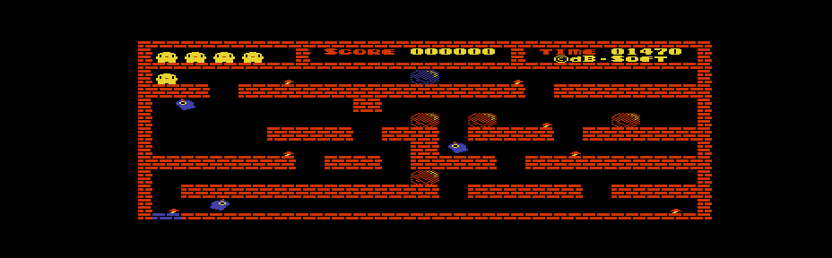
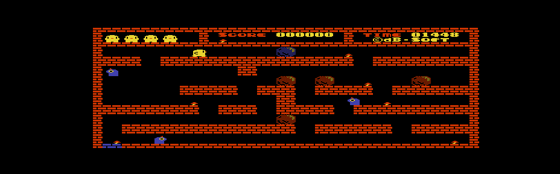
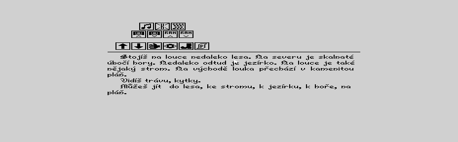

# MZF/M12 native takeover research — 2026-10-08

This is a one-way bootstrap, distinct from native CP/M COM extraction. No
CP/M calls are allowed after relocation/takeover. Reset is the exit path.
The generated code is original; historical executables are not distributed.

## Historical evidence before transition implementation

MZX.COM was extracted from `MZTool.Tests/DSK/CPMv41 Programy Demo 1 MZF.dsk`,
user 15, 3584 bytes, SHA-256
`590E9E69248CD4046AC0D997A47546291984FFA381293ED1731CC9CCBA271FC7`.
See [the previous disassembly](MZF_CPM_INTEROP_RESEARCH.md) for entry/dispatch.
Its embedded help uses `CMT R name` to run tape input and `CMT M` for monitor.
The R path relocates 130 bytes to 1000, sets SP=10F0, disables interrupts,
selects IM1, writes CE=08, CD=01, CC=01, maps CG-ROM with IN E0 and copies
4096 bytes from 1000 to C000, then unmaps with IN E1 and jumps to 1007.
The relocated helper unmasks RAM with OUT E0/E1, enters EE03, then later maps
ROM with OUT E4 and uses monitor services. Thus this historical runner depends
on additional upper-memory code and ROM work areas; its 130-byte helper alone
is not a standalone loader. Tape I/O and return branches are not reused.

MZRUN.COM and RUNMZFN.COM are indexed by the
[SCAV software archive](https://mz-800.scav.cz/download/MZ-800/download_MZ-800_software.html)
and [disk listing](https://mz-800.scav.cz/sharp_mz-800/sharp_mz-800_w_Download_DSK.htm).
No identified binary was found in the current local corpus. Direct acquisition
failed TLS validation in Python and the system HTTP client; the browsing tool
could not retrieve the binary. Command syntax, size, SHA-256, header handling,
copy, banking, interrupts, stack, entry and return behavior remain unknown.
MZXCONV.COM and MZXBACK.COM were also unavailable: all those fields remain
unknown. Archive filenames are not runtime evidence. These unknown utilities
are not used as implementation references.

## Local primary sources

- `../MZ-SD2CMT2-Reborn/src/formats/file_format.h`: MZF/M12 contain a 128-byte
  Sharp header and its declared body. This does not establish multipart support.
- `../MZ-SD2CMT2-Reborn/src/play/mzf_loader.cpp`, `ranges_overlap` and
  `select_loader`: compare full half-open target and loader footprints. The new
  COM loader uses this principle, not that tape loader's addresses or code.
- `../mz800emu/src/emulator/mzarch/mz800/memory/mz800_memory.c`:
  OUT E0 removes bottom ROM/CG-ROM; OUT E1 removes upper ROM; IN E1 removes
  graphics/CG mapping; OUT E2 restores bottom monitor; OUT E3 restores upper
  ROM; OUT E6 clears prohibited mapping. IN E0 enables graphics/CG mapping.
- `../mz800emu/src/emulator/mzarch/mz800/gdg/mz800_gdg.h`: DMD bit 3 means
  MZ-700 compatibility (08); DMD=00 means MZ-800 320x200. The MCP platform
  status comment labels this bit oppositely; use the hardware implementation.
- `../mz800emu/src/emulator/mzarch/mz800/mz800_bootstrap.c`: direct-load
  bootstrap restores monitor ROM, loads fonts and chooses an explicit mode.

## Constraints

Selecting a CP/M profile alone cannot establish a game's required hardware
state or independence from later tape loads. The native state is an explicit
choice, and reports must state it. No byte-pattern scan certifies independence.
MZF headers, exact body length, full segment ranges, executable entry, stage
source/destination and CP/M load capacity must be checked separately.

No universal game compatibility or real-hardware certification is implied by
reaching EXEC in an emulator. Validation details are added with actual results.

## Implemented bootstrap contract

COM origin is 0100. Stage 0 ends before 0140; the Stage 1 source is at 0200,
the original header at 0300, and the NZC1 metadata at 0380. Raw payload starts
at 1200. LOW occupies 1000..10EF (code plus private stack); HIGH occupies
A000..A0FF. The planner compares the complete loader footprint against every
target and the still-live source, as well as the pre-takeover protected ranges.
LOW is reserved COM padding, not an assumed free CP/M address.

Named CP/M variants currently share a C000 exclusive load ceiling (the initial
implementation used B000, which rejected the larger supplied game files).
They are bootstrap contracts, not measured maps of each OS version. Stage 0
also requires JP at 0005 and enough room below the live BDOS entry minus six.
Failure returns using the original CP/M stack before DI or hardware takeover.
Stage 1 uses no CP/M services, CALL or PUSH. It selects DI/IM1, unmapped RAM,
PPI/PIO state, muted PSG and explicit GDG read/write modes. It copies the
header to 10F0 before the payload, uses LDIR/LDDR according to actual overlap,
restores the selected ROM mode, sets its private SP and jumps to original EXEC.
The updated transition restores native 8253 timer setup, enables the PPI PC2
timer interrupt gate and reads floppy status to acknowledge pending INTRQ.
MZ-700 mode additionally copies 4 KiB of CG-ROM to CG-RAM using HIGH.
Monitor work-area requirements of arbitrary games remain unknown.

Single type-1 records are supported. Non-padding trailing records, multipart
inputs, invalid EXEC, overflow, inadequate COM capacity and unsafe placement
are Unsupported. The UI explains the requirement for a self-contained program;
the program does not infer it from instruction byte patterns. There is no
compression or CP/M return path. RESET is the documented exit.

UI follow-up: the Tools menu now exposes one MZF/M12 → COM workflow. The
self-contained limitation is announced before conversion without a required
checkbox. Known multipart/trailing dependencies still block conversion with a
visible reason. Export / Save writes a separate file; Import to current disk
validates a private CP/M image, verifies the serialized payload, then applies
the preview in memory. Existing files are preserved and collisions require a
different filename. Saving the current image is separate.

## Initial emulator validation, 2026-10-08

The local mz800emu executable ran headless through its JSON pipe. Filesystem
fixtures were read-only; generated COMs and the modified test disk were written
to a temporary directory. No original reference image was changed.
Emulator executable SHA-256:
`983D12483980D74DF62A64FEFA3F7A4051D1386065F3D1BAFB375BFACFD2A1FA`.

[Machine-readable results](validation/native-com-emulator-2026-10-08.json)
record output and payload SHA-256, size, PC/SP and breakpoint results for five
cases: LOW, HIGH, overlapping LDDR, MZ-700 monitor/font initialization, and
FLAPPY ver 1.0A (LOAD=EXEC=6B66, 24,331 payload bytes). Each case started at
COM origin with an explicit CP/M-compatible memory/vector setup. A breakpoint
at original EXEC stopped execution; the entire target payload was read back
and compared byte for byte. These runs verify the loader, not gameplay.

A separate run booted a temporary copy of AFTER-2_bootable_41IRQ.dsk in the
emulator (LC 60k CP/M 4.1 Driver HD banner). Page zero had BDOS entry DC06,
giving a DC00 boundary. The CCP command NATIVE loaded and ran the generated
LOW test COM from that disk. Full payload and original EXEC=2000 matched.
[CP/M command-run evidence](validation/native-com-cpm41-2026-10-08.json)
records the actual vector, registers and breakpoint result. Keyboard automation
used one frame per key; longer holds repeat characters in this CP/M driver.

An additional NATGAME command attempt with Flappy on that temporary disk did
not reach either COM origin or EXEC within the run budget; PC was 0038.
The cause before COM entry is unresolved. Thus Flappy has only the direct
bootstrap/payload verification above, not successful CCP loading or gameplay
certification. P-CP/M80 and physical hardware remain unverified.

## Expanded game compatibility and runtime validation

This follow-up supersedes the initial Flappy-only entry check above. The three
reported inputs are now convertible with the default C000 profile, including
the uncompressed 44,033-byte Flappy and 41,856-byte Belegost. The previous B000
bound rejected them due to the COM payload starting at 1200; their COM ends are
BE01 and B580 respectively. The sampled live CP/M boundaries are CE00 for native
P-CP/M80 and DC00 for CP/M 4.1, both above C000. Stage 0 still checks the live
vector, including any HIGH loader footprint, before takeover.

The packed Flappy decodes with the existing ZX7/ZX0 service to exactly the
supplied uncompressed Flappy: 44,033 bytes at LOAD=EXEC=1E00, SHA-256
`ce4aa3d4513bc01c52457b4e2e50f9ea02b69c5dd0629ae0d54005d6dd66c943`.
The COM builder preserves input payload bytes and adds no compression. Its
report now identifies recognized source compression separately.

The old transition reset PPI port C to zero and omitted native 8253 setup.
This disabled the PC2 timer IRQ gate and left CP/M timer state in effect. The
updated sequence follows the local emulator's monitor bootstrap initialization
(`src/emulator/mzarch/bootstrap.c`), with port decoding checked against
`mz800_iorq.c` and interrupt gating against `mzarch/interrupt.c`. CPU interrupts
remain DI until the native program enables them. Native timer initialization is
performed in MZ-800 mode before any MZ-700 switch. No game payload is patched.

Tests booted temporary copies of the reference P-CP/M80 and CP/M 4.1 IRQ disks
and invoked the generated COMs through their CCPs. Both Flappy variants reached
the running room screen after Space; Belegost reached its interactive text game
after the opening sequence. The old-loader comparison with identical inputs
left Belegost in its intro during the same input sequence. The user's precise
Flappy freeze is not yet established as a uniquely reproduced failure of the
old loader; the missing timer/IRQ initialization was independently identified
and corrected. This distinction avoids attributing every freeze to one cause.

[Extended runtime results](validation/native-com-games-runtime-2026-10-08.json)
record source/output hashes, full payload comparison at original EXEC and a
20,000-frame trace for each game after 4,000 initial frames and 2,500 frames
with keyboard input. Each run removed inherited debugger breakpoints before
boot, kept only the temporary EXEC breakpoint for payload verification, then
removed it before gameplay. All requested frame budgets completed. Flappy's
visible timer and enemies continued to change during the extended run. This
is a startup/input/continued-execution smoke test, not a full playthrough or
proof that every room and game state is compatible. Physical hardware remains
unverified.

An additional packed-Flappy check booted P-CP/M80, ran P.COM, started the game
with Space and held Right for 40 frames. The player moved from the upper-left
start to the right, and the visible timer decreased from 01470 to 01448.
Holding Down afterward advanced the timer to 01426 without stopping enemies.
These screenshots provide a direct input/visible-state check beyond CPU progress:

To reproduce, build the app, create a native P-CP/M80 disk and install its IPL
and PCPM.SYS from the reference image. Export the three supplied MZFs using
MZ-800 monitor state and the default C000 ceiling; insert as P.COM, F.COM and
B.COM. Save a separate disk, boot it in mz800emu with F and invoke each program
from a fresh boot. Remove inherited debugger breakpoints before testing; an
EXEC breakpoint is useful only for verifying the initial copy and must then be
removed. Test the demo and actual game with Space and held arrow keys. For
CP/M 4.1, use a separate copy of AFTER-2_bootable_41IRQ.dsk, insert one output
as G.COM and invoke G after boot. Original fixture files remain unchanged.
Previously exported COMs retain the old bootstrap and must be regenerated.

## Optional compression and filename/save workflow

The later UI request extends the original no-new-compression scope. Keep source
remains the default. None decodes recognized ZX0/ZX7 input; explicit ZX0 quick
and ZX7 policies support both directions. The existing tape compressor creates
the self-extracting native payload; the original takeover bootstrap remains
uncompressed. The resulting MZF loader entry/ranges are passed through the same
LOW/HIGH and live-TPA checks. Every newly compressed candidate is decompressed
on the host and checked against the original payload, LOAD and EXEC. Auto picks
the smallest supported COM among verified candidates and retained input; unsafe
placements are excluded rather than selected for size alone. The source hash
still identifies the original input and the output hash identifies the final COM.

[Compression runtime validation](validation/native-com-compression-runtime-2026-10-08.json)
records fresh conversions of the supplied uncompressed Flappy with ZX0 quick
forward/backward and ZX7 forward/backward. All four were loaded by CCP from a
temporary native P-CP/M80 disk. Execution stopped at restored EXEC=1E00 and all
44,033 expanded bytes matched the original. After removing the breakpoint,
each ran 4,000 frames, accepted Space to start and Right for 40 frames, then
produced its gameplay screenshot. COM sizes were 29,618 / 29,662 bytes for ZX0
and 30,555 / 30,577 bytes for ZX7. These remain startup/input tests, not complete
gameplay certification.

The default editable COM filename now derives from the decoded Sharp header,
retains CP/M-safe letters/digits/underscore/hyphen, truncates the stem to eight
characters and appends .COM. Export uses the same suggestion. Empty names use
PROGRAM.COM. IPL Save As and Export share one dispatch: a single record opens
single-program IPL options; multiple records open multi-program options. The
save filter advertises this automatic choice. Both paths preserve source records
and retain their existing compression/options dialogs.

### Conversion dialog usability correction

The main dialog now shows the source name/type, compression, filename and a
short actionable status. Advanced settings and the technical report are collapsed
initially; report export remains available inside Technical details. File type
rejections explain that only machine-code OBJ programs can be converted, and
extra trailing data is distinguished from memory/loader placement failures.
Selecting one independent record from a workspace containing several records
no longer incorrectly marks it as multipart. Actual trailing dependencies and
explicit multipart inputs still block conversion. Import applies the verified,
transactional insertion directly; export writes after the normal Save picker.
Neither opens a second technical-report confirmation window.

### HLIPA executable header and included system sources

`Hlipa.mzf` is type 4D, LOAD=1200, length=B852, EXEC=116C. With the native
header at 10F0, EXEC points to header offset 7C: `JP CA00`. CA00 lies inside
the supplied payload. The converter now validates this header jump and preserves
the entire header at its native address; it does not change the original type
or blindly accept other unknown types. Recognized packed inputs validate against
their restored LOAD/EXEC/size. Entry points outside both the payload and a valid
header jump still fail. Compression may not replace executable header bytes.

The original program is too large for the default C000 COM ceiling. Quick ZX0
also does not fit; Auto now falls back to optimal ZX0 when the quick choices
fail. Optimal ZX0 is also explicitly selectable. Auto produces a 48,408-byte
COM from both supplied original and ZX0-packed HLIPA; both outputs are identical.
`Hlipa2.mzf` produces a 31,945-byte COM. [Runtime results](validation/native-hlipa-runtime-2026-10-08.json)
record all three loaded by CCP from a freshly generated P-CP/M80 disk installed
from the included source. For original HLIPA, a breakpoint at 116C verified all
47,186 restored payload bytes and all 128 header bytes before executing them.
All three reach the animated menu and accept H to enter clock setup. Original
HLIPA also passes clock/alarm setup (1200/A, 1230/A), accepts default controls
and no joystick (A/N), and reaches the [gameplay screen](validation/native-hlipa-gameplay.png).
This is startup/input validation, not a complete playthrough or hardware certification.

The Make Bootable dialog embeds the supplied `/boot/*.dsk` sources and checks
their fixed original hashes before use. Six CP/M sources pass their existing
registered fingerprints and install through the validated system builder;
native P-CP/M80 includes allocated PCPM.SYS. Regression tests install all six,
preserve existing user-7 KEEP.COM, reopen and verify system identity and a clean
Analyzer. The seventh image, CPMv23System_320K.dsk, is a standalone IPL/custom
layout and is explicitly unavailable for installation into these CP/M layouts.

### Shared compression UI

The COM dialog now uses `CompressionOptionsControl`, matching MZF export and
single IPL export. It exposes algorithm, direction, ZX0 quick, embedded ZX7 and
expert/partial settings. Keep source remains the default COM policy. Controls
stay visible when unavailable; standalone COM rejects skip/partial compression
because omitted bytes would depend on pre-existing memory. Embedded ZX7 remains
available for ordinary COM inputs, but cannot overwrite a validated executable
header. Direct IPL retains its existing restrictions on embedded/partial loaders.

Both IPL table workflows open the complete shared panel when the compression
value is clicked. Selected rows can receive one configuration together. The
settings dialog previews each program asynchronously, shows activity and the
current program count, and applies only after the user chooses Apply. Prepared
results are reused by layout rebuilding; cache identity includes all options,
so a direction/quick change under the same algorithm cannot reuse stale bytes.
Imported backward loaders retain their direction. COM conversion also displays
activity, disables output actions while running, and cancels superseded work.

For a hardware trial, export GAME.COM and its report, copy it onto a disposable
CP/M disk, verify the profile/load ceiling, then invoke GAME. Record machine,
CP/M version, native state and output SHA-256 with the result. RESET exits.
Keep original media separate. A failed or partial test must not be recorded as
compatibility certification.
